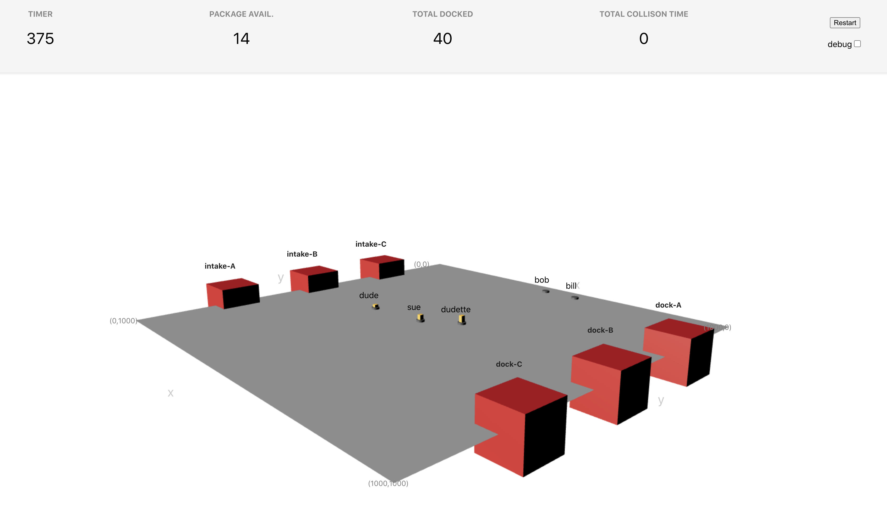

# Autonomous Fulfillment Robot Starter

This codebase acts to provide you a fully working, starter baseline for optimizing your robotic fulfillment center.



Your mission is to optimize the cross-docking that needs to occur in the fulfillment center using your autonomous robots that each can carry packages.  You are looking to minimize the `Packages Available` and maximize the `Total Docked`, while keeping the `Total Collision Time` to 0.  You will be judged on the final numbers for each of these parameters over a simulation time of 3500.

You have 5 autonomous robots at your disposal to service 3 intake locations and 3 docks.  The goal is to take as many packages as possible from the intake locations and move them to the docking locations.  Here are some facts:

1. Packages are continually added to all the intake locations on a regular basis.  The adding of packages is deterministic.  The model is not specified, but you can likely collect some data to figure it out (if it helps you).
2. The provided `controller.py` code performs a sub-optimal strategy.  You could choose to use this one, but you will lose, and not get a good grade.  With that said, there is no right answer - just do the best you can.
3. Packages are automatically assigned to be delivered to specific docks.  When a robot enters an intake location, and has available capacity, the packages are automatically loaded onto the robot by another robotic process.  There may be some delay in the loading process, but it is generally (statistically) quantifiable.
4. When a robot enters a dock location and there are packages slated to be delivered to that dock location, they are automatically unloaded from the robot.  Again, this is a relatively quick process.
5. Collisions between robots can occur, and is quantified by the amount of time the robots are overlapping.  This is a double count, as both robots will be counting their collision time.  This should be avoided at all costs.
6. Robots report in on a regular basis, as well as when they reach their destination.  They will also report their status if they are colliding.  There is a rate limit to how often they report.  This is generally around 1500ms, but will vary based on performance of the network they are on, and how complex the calculations are that are being made.
7. Locations report their status on a frequent basis (every 2-5s).  
8. Robot speeds max out at 25 speed units.  You can try to specify above that, but the max speed will top out at 25.
9.  You can specify any `(x,y)` coordinate pair you want as a destination.  It is recommended to keep it in the warehouse layout.  Why would you specify outside of it anyways?
10. The UI can be a bit buggy - there are a lot of 3D calculations going on, and I didn't spend the time to optimize the code.  I recommend making sure to keep the browser window open and in the forefront when running a simulation.  If you don't keep it forefront, the browser optimizer processes will selectively compute certain calculations but not others, and you will get nonsensical numbers.
11.  Everything is structured as a timed loop, and every team functions on the same compute platform.  Therefore, you should all be on even playing ground (even if your simulations tend to seem slower or faster from run to run), the final numbers should be consistent.  Turning the `debug` off will certainly speed stuff up!
12. You may see non-physical jitters with your robots - it's just the graphics, and they are not optimized.
14. Restarting your REST API server and your controller will restart it from scratch with no memory.  Keep this in mind when you are designing your optimization.  Feel free to provide a persistence layer (`sqlite` is a good one), but it is not necessary to do a great job.
15. The robots autonomous paths are based on unit vector calculations based on the cartesian coordinate system, and are computed at each tick of the clock.  Therefore, the paths are not optimal.  You may find it a good idea to control the paths a bit more carefully...but keep in mind, the mmore communications you force, the worse the network performance gets!


## Files available to you
The main server (REST API) is found in `app.py`.  

The controller (the thing that runs a loop and does your optimmization control) is found in `controller.py`.


## REST API
The following API calls are made by the Robots and Fulfillment center.  You must make sure you follow the definitions exactly, or else your robots won't work!

#### Report Robot Status
> `POST /devices/<id>/status`

Example Respone:
```
{
	"name": "sue",
	"x": 1000,
	"y": 500,
	"speed": 0,
	"destination": [1000, 500],
	"hasPayload": true,
	"payloadCount": 16,
	"maxPayloadCount": 50,
	"connected": false,
	"lastReport": 42000,
	"payloadSplit": {
		"dock-A": 11,
		"dock-B": 0,
		"dock-C": 5
	},
	"clock": 4260
}
```


#### GET Robot Status
> `GET /devices/<id>`

Response:
```
{
    "clock": 1110,
    "connected": true,
    "destination": [
        1000,
        250
    ],
    "fromStop": true,
    "hasPayload": true,
    "lastReport": 10500,
    "maxPayloadCount": 50,
    "name": "dude",
    "payloadCount": 25,
    "payloadSplit": {
        "dock-A": 0,
        "dock-B": 19,
        "dock-C": 6
    },
    "speed": 0,
    "x": 1000,
    "y": 250
}
```

#### GET Robot Commands
> `GET devices/<id>/commands`
Gets the latest command set send to the robot.  The robot uses this to retrieve its latest commands (speed and destination coordinates):

Response:
```
{
    "destination": [
        0,
        750
    ],
    "id": "dude",
    "speed": 20
}
```


#### POST Robot Commands
> `POST /devices/<id>/params`
Helper route that allows an opimization process to post a command for a robot to read with the `GET /devices/<id>/commands` route.

Example Request:
```
{
    "destination": [0,750],
    "speed":20
}
```

Example Response:
```
{
    "destination": [
        0,
        750
    ],
    "id": "dude",
    "speed": 20
}
```

#### POST Fulfillment Location Status
> `POST /fulfillment-locations/<id>/status`
The route that the fulfillment (intake and dock) locations will hit to provide their specific updates.

Example Request:
```
{
	"name": "sue",
	"x": 25,
	"y": 500,
	"speed": 25,
	"destination": [0, 500],
	"hasPayload": true,
	"payloadCount": 50,
	"maxPayloadCount": 50,
	"connected": true,
	"lastReport": 34500,
	"reportFrequency": 500,
	"setSpeed": 25,
	"payloadSplit": {
		"dock-A": 50,
		"dock-B": 0,
		"dock-C": 0
	},
	"clock": 3840
}
```

Expected Example Response:
```
{
	'available': 0,
	'total': 0,
	'lastReport': 0,
	'isDock': true
}
```

#### GET Fulfillment Location Status
> `GET /fulfillment-locations/<id>`
Gets the status of the fulfillment location

Example Response:
```
{
    "available": 492,
    "isDock": false,
    "lastReport": 0,
    "payloadSplit": {
        "dock-A": 145,
        "dock-B": 155,
        "dock-C": 192
    },
    "total": 50
}
```